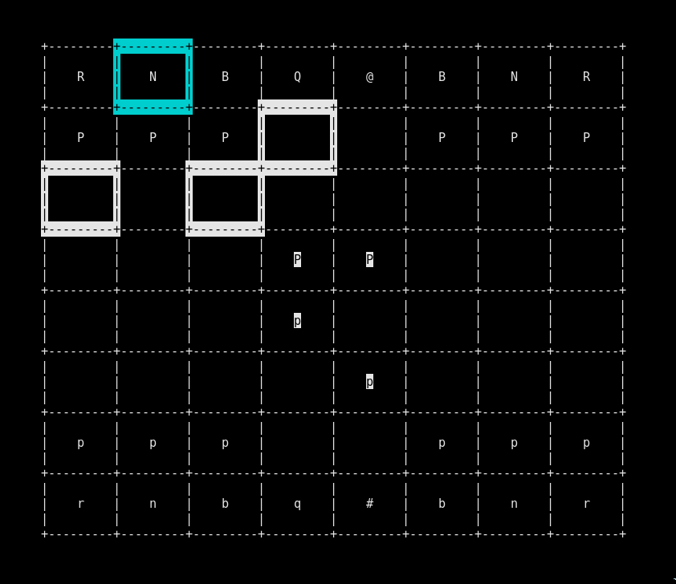

# Termchess - terminal-based chess emulator

## Screenshot (will probably be updated later)


## Build
To build this project you must have ncursees installed

```
$ git clone https://github.com/theonekeyg/termchess.git
$ cd termchess && make
```

## Hotkeys
h/arrow left - Move left
j/arrow down - Move down
k/arrow up - Move up
l/arrow right - Move right
s - Select piece
t - Move selected piece to current square
